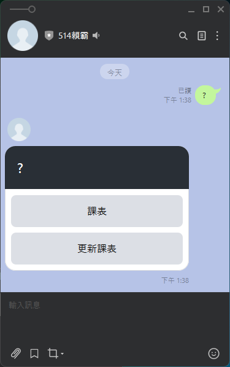

# FJCU 514 Line Bot 

## 目前功能
- [x] 課表選單
  - [x] 下一節課
  - [x] 更新課表
  - [x] 課表表格(WebView)

- [x] 學校地圖檢視
  
## 可能新增功能
- [ ] 最新消息
- [ ] 登入功能
  - [ ] 資料庫
  - [ ] LIFF
  - [ ] Access Token機制
  

..功能介紹待補..

## 輸入 & 輸出模式

使用Line Bot輸入指令，Line API會透過網頁傳送Post至Flask服務。
Flask收到Post指令，並處理完對應任務後，透過Line Message API回傳。





## Python語法應用

...待補...

## 程式碼資訊

### 環境
`後端語言`:Python 3.11

`Module`:

```
line-bot-sdk
flask
pytz
lxml
bs4
requests
python-dotenv
folium
```

`Host平台`: Azure Web Services

### 命名規則

Camel Case


## 檔案用途切分

``` 
├─data
│     ├─courseData.json
│     └─map.geojson
│      
└─templates
│     └─course.html
├─.env
├─app.py
├─command.py
├─common.py
├─coursedata.py
├─LineMessage.py
├─map.py
├─scraper.py
└─requirements.txt     
```

`data/`: 放資料檔案

`data/courseData.json`: 課表資料

`data/map.geojson`: 學校地圖資料

`templates/`: 模板存放路徑

`templates/course.html`: render 課表的模板

`.env`: 放Line BOT API Token

`app.py`: 專案執行檔，設定訊息接收與回應、網頁路由

`command.py`: 指令對應動作

`common.py`: 一些共用參數存放位置

`coursedata.py`: 處理課表資料用的函數

`LineMessage.py`: 存放Line BOT回應訊息的模板

`map`: render map資料

`scraper.py`: 爬課表網站用的爬蟲

`requirements.txt`: 部屬所需安裝的Python套件


## 更新歷程

2024
  - 5/21 完成初版，包含課表選單、下一節課、課表(WebView)
  - 5/22 新增簡易地圖功能


---
Python Course Final Project 
